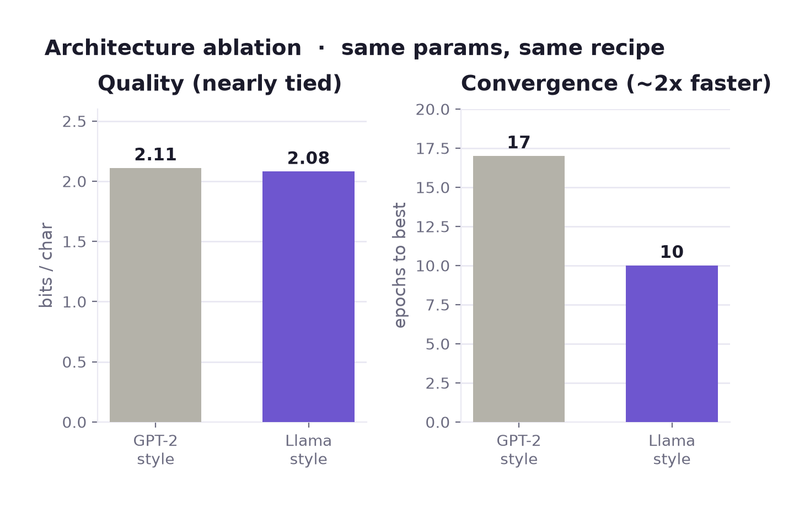
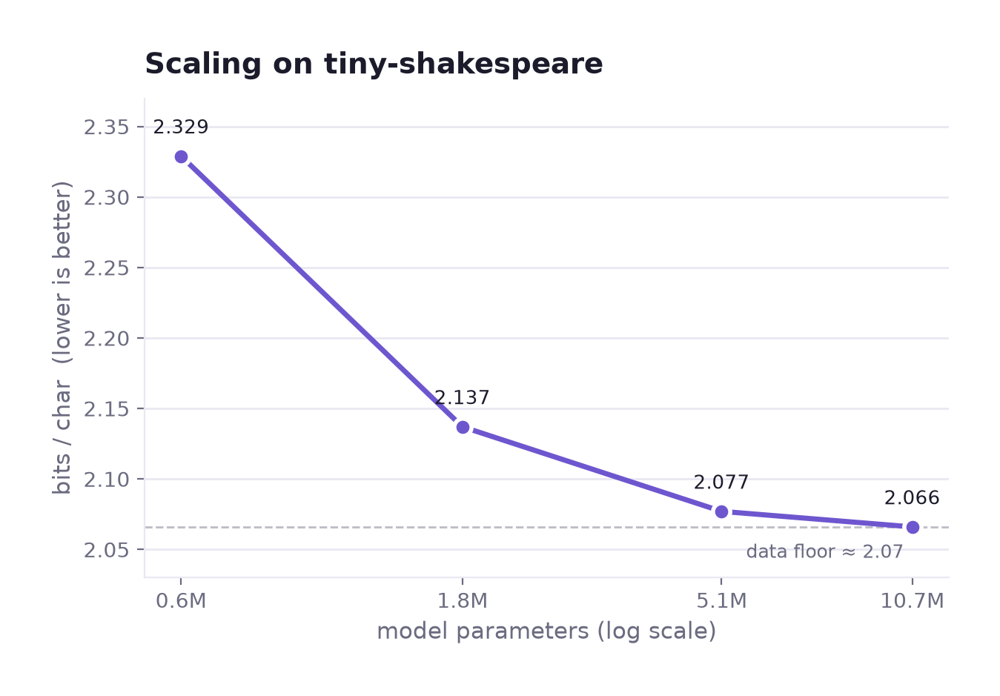
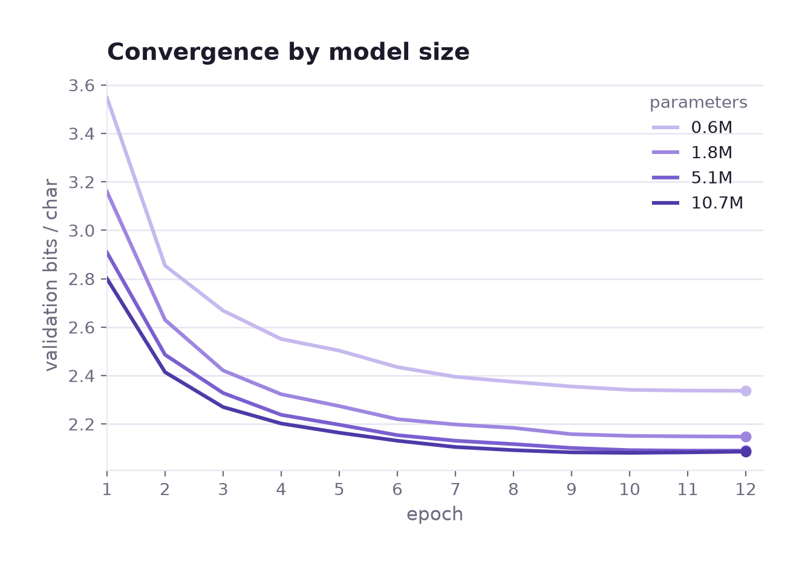
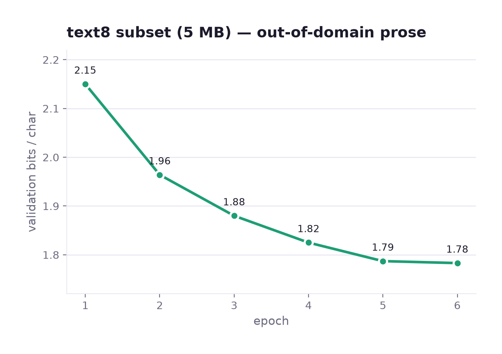

# Benchmarks

Honest, reproducible numbers on a modest, laptop-scale setup (Apple M-series, MPS).
The headline: **a from-scratch, Llama-style decoder (RoPE + RMSNorm + SwiGLU) that
matches the well-known [nanoGPT](https://github.com/karpathy/nanoGPT) baseline on
tiny-shakespeare, trained in ~10 minutes on a MacBook.**

## Headline result

| | |
|---|---|
| Task | character/byte-level language modelling, tiny-shakespeare (1.1M chars) |
| Model | Llama-style (RoPE, RMSNorm, SwiGLU), 6 layers, 384-dim, 6 heads, **10.7M params**, block 256 |
| Held-out loss | **1.44** |
| Perplexity | **4.22** |
| **Bits/char** | **2.08** |
| Reference (nanoGPT) | ~1.47 loss / ~2.1 bits/char |

**Bits/char** (nats/char ÷ ln 2) is the metric that matters — tokenizer- and
model-independent — and it puts Zenith right on the nanoGPT reference.

## Architecture ablation (GPT-2-style vs Llama-style)

Same recipe, same ~10.7M params, same data — only the architecture differs:

| Architecture | Params | Bits/char | Converged at |
| :----------- | -----: | --------: | :----------- |
| GPT-2-style — LayerNorm, learned pos, GELU | 10.8M | 2.11 | epoch 17 |
| **Llama-style — RMSNorm, RoPE, SwiGLU** | 10.7M | **2.08** | **epoch 10** |



The modern architecture is **slightly better *and* converges roughly twice as
fast** (best val at epoch 10 vs 17). The honest caveat: both land near ~2.1 bpc —
at this scale the floor is set by *data and model size*, not the architecture. The
architecture buys **convergence speed** (and a little quality); breaking the ~2.1
ceiling needs a bigger model or more data.

## Scaling study (bits/char vs model size)

Same Llama-style recipe, same data, only width/depth change — one command,
`python scripts/scaling_study.py`:

| Params | Bits/char | Δ vs previous |
| -----: | --------: | :------------ |
|  0.60M | 2.329 | — |
|  1.82M | 2.137 | −0.192 |
|  5.06M | 2.077 | −0.060 |
| 10.73M | 2.066 | −0.011 |



The same runs, as validation curves over training — bigger models start and finish
lower, and all four flatten toward the same floor:



Every ~3× in parameters buys less: **−0.19, then −0.06, then −0.01** bits/char. The
curve flattens into tiny-shakespeare's **data floor** — at ~1 MB of text a 10M model
has already extracted most of what's there. Going lower needs *more data*, not a
bigger model. That's the honest, unglamorous, correct result — and exactly why a
harder, larger corpus (text8) is the natural next benchmark.

## Second corpus: text8 (harder, out-of-domain)

Shakespeare is small and stylistically narrow. **text8** — the standard char-LM
benchmark (lowercased English Wikipedia, a 27-symbol alphabet: `a–z` + space) — is
a very different, more general corpus. Same 10.7M Llama-style model, a **5 MB
subset**, 6 epochs (`scripts/download_text8.py`):

| | |
|---|---|
| Corpus | text8, first 5 MB (subset) |
| Held-out loss | 1.236 |
| Perplexity | 3.44 |
| **Bits/char** | **1.78** |



Sample (prompt `" the "`, temperature 0.7):

```
anglican church in africa this are far additionally compromised the existence of
the species of anglicans norway main article christians anglican community of
africa groups have approved that argument
```

Coherent, on-topic, real-word English — a clear step up in generality from
Shakespeare's verse.

**Read this honestly:**
- **It's a 5 MB *subset*, not full text8 (100 MB).** Char-LMs trained on the full
  corpus with more compute reach ~1.3–1.5 bpc; our subset number is not comparable
  to those and isn't meant to be.
- **The lower bits/char vs Shakespeare (1.78 vs 2.08) is mostly the alphabet.**
  text8 has 27 symbols; Shakespeare uses full ASCII. Fewer symbols ⇒ lower entropy
  per character. This is *not* "text8 is modelled better" — it's a different, easier
  per-character alphabet. Bits/char is only comparable *within* a corpus.
- The value here is a **second, out-of-domain corpus** proving the model isn't
  memorising one tiny book — plus an honest, reproducible recipe.

## Speculative decoding (greedy, exact)

A **0.6M draft** proposes tokens; the **10.7M target** verifies them in one forward
pass and keeps the longest prefix it agrees with. The output is **byte-for-byte
identical to greedy** on the target — only the number of target forward passes
changes. Measured on tiny-shakespeare (prompt `"KING RICHARD III:"`, 200 tokens,
`scripts/speculative_demo.py`):

| Lookahead | Acceptance | Target forwards (vs 200) | Forwards saved |
| --------: | ---------: | -----------------------: | -------------: |
| 2 | 76% | 80 | 2.5× |
| 4 | 52% | 66 | 3.0× |
| 6 | 45% | 55 | 3.6× |
| 8 | 35% | 54 | 3.7× |

Every run is verified identical to greedy. A longer lookahead trades acceptance rate
(the draft is likelier to be wrong deeper into a guess) for fewer target passes,
plateauing around **3.7×**.

**The honest part — forwards ≠ wall-clock.** On this setup (10.7M target, 0.6M draft,
MPS) the same run is only **~1.05–1.08× faster in wall-clock**. Two reasons: the
target is small, so one forward is cheap relative to per-call overhead; and the
draft's extra forwards aren't free. Speculative decoding pays off in wall-clock when
the target is *much* larger than the draft and each target forward dominates runtime.
The forward-pass reduction is the hardware-independent signal — and it's real (3×+);
the wall-clock gain at this scale is not yet the story.

## What got us here (in order of impact)

1. **GPT-2 initialization** — N(0, 0.02) weights, residual projections scaled by
   `1/sqrt(2·n_layers)`. Roughly halved epochs-to-converge; the single biggest lever.
2. **Modern architecture** — RoPE + RMSNorm + SwiGLU: faster convergence, slightly
   lower loss, fewer params.
3. **Training to convergence** with an LR schedule matched to the run (and
   best-checkpoint saving, since it overfits this tiny corpus after ~10 epochs).

## Sample (Llama-style model, prompt `KING RICHARD III:`, temperature 0.7)

```
KING RICHARD III:
Brother, and on thee cry the children of your virgins,
By this the other heart of an intercept,
That live I see the commons of men cold days:
But in the house of York and Margaret,
When I have set thee from my heart to
```

Iambic cadence, real syntax, speaker format, and near-coherent meaning — learned
from raw bytes in ~10 minutes on a laptop.

## Tokenizer comparison (bits/char, the fair metric)

| Tokenizer | Vocab | Bits/char | Notes |
| :-------- | ----: | --------: | :---- |
| byte      |   259 |  **2.08** | headline (Llama-style, converged) |
| bpe       |  1024 |     ~2.65 | undertrained here, but the from-scratch BPE tokenizer now trains vectorized (numpy), ~8× faster than the naive loop |

## Reproduce

```bash
python scripts/download_corpus.py
python -m zenith.cli.train \
    data.corpus_path=data/tiny_shakespeare.txt data.stride=128 \
    model.block_size=256 model.embed_dim=384 model.num_layers=6 \
    model.num_heads=6 model.ff_dim=1024 model.dropout=0.2 \
    training.epochs=12 training.batch_size=64 training.learning_rate=1e-3
zenith eval -m zenith-lm.pt -c data/tiny_shakespeare.txt
```

Switch to the GPT-2-style architecture for comparison with
`model.norm=layernorm model.positional=learned model.ffn=gelu`.

## Honest notes

- **2.08 bits/char matches, and marginally beats, the nanoGPT reference** — genuinely
  good for a from-scratch model at this scale. A bigger model or more data would go
  lower (well-tuned char models on larger corpora reach ~1.0–1.5 bpc).
- The model **overfits after ~10 epochs** on this tiny corpus; best-checkpoint
  saving handles it. Early stopping is a natural future addition.
- MPS is the bottleneck (~2–3 steps/s at this size); a CUDA GPU is far faster.
